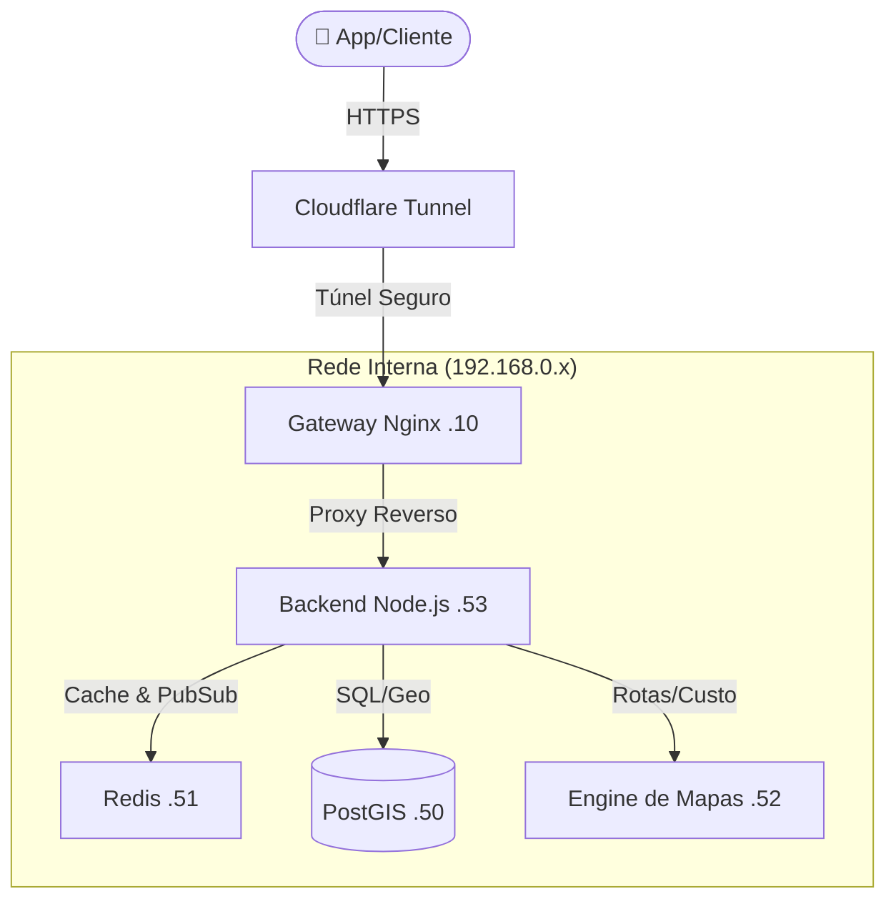

# 🏍️ TripShare - Plataforma de Mobilidade Urbana

> **Arquitetura de Microsserviços de Alta Performance para Logística e Transporte.**

O **TripShare** é uma solução de backend robusta para aplicativos de transporte (semelhante ao Uber/99), focado em oferecer taxas justas para motoboys. O projeto foi construído utilizando o conceito de **Infrastructure as Code (IaC)**, com microsserviços isolados em containers LXC, orquestração Docker e comunicação via rede interna de baixa latência.

---

## 🏗️ Arquitetura do Sistema

O sistema roda em um ambiente virtualizado **Proxmox**, onde cada responsabilidade é isolada em seu próprio container (LXC) para segurança e escalabilidade.


### 🧩 Componentes da Infraestrutura

| Serviço | Tecnologia | Função | IP Interno (LXC) |
| :--- | :--- | :--- | :--- |
| **Gateway** | Nginx + Cloudflare | Proxy Reverso, SSL Offloading e Roteamento | `192.168.0.10` |
| **Backend** | Node.js (Express) | API REST, Regras de Negócio e Precificação | `192.168.0.53` |
| **Database** | PostgreSQL + PostGIS | Armazenamento de Usuários e Dados Geoespaciais | `192.168.0.50` |
| **Cache** | Redis (Alpine) | Gerenciamento de Sessão e Tempo Real | `192.168.0.51` |
| **Geo Engine** | OSRM (C++) | Cálculo de Rotas e Distâncias (Mapas Offline) | `192.168.0.52` |

## 🚀 Funcionalidades Principais

* **Cálculo de Rotas Offline:** Utiliza uma instância própria do OSRM com mapas da região Norte do Brasil, eliminando custos com APIs externas (Google Maps).
* **Precificação Dinâmica:** Algoritmo que calcula o valor justo da corrida baseada em `(Km * Tarifa) + (Tempo * Tarifa)`.
* **Geolocalização:** Armazenamento e consulta de coordenadas geográficas (Latitude/Longitude) com precisão via PostGIS.
* **Segurança (Hardening):**
    * Todos os serviços rodam atrás de um Firewall (UFW) com política "Deny All".
    * Acesso externo apenas via Cloudflare Tunnel (Portas do roteador fechadas).
    * Variáveis de ambiente (`.env`) para proteção de credenciais.
* **Alta Disponibilidade:** Serviços configurados com `PM2` e `Docker Restart Policies` para recuperação automática.

## 📂 Estrutura do Repositório (Monorepo)

```bash
tripshare/
├── backend/           # Código Fonte da API (Node.js)
│   ├── server.js      # Entrypoint e Rotas
│   └── src/           # Lógica de aplicação
├── database/          # Modelagem de Dados
│   └── schema.sql     # Estrutura das tabelas (Usuários, Corridas, Geo)
├── infra/             # Infrastructure as Code (Scripts de Provisionamento)
│   ├── install_redis.sh    # Script de Hardening + Deploy Redis
│   ├── install_osrm.sh     # Script de Compilação de Mapas + OSRM
│   ├── install_backend.sh  # Setup de ambiente Node + PM2
│   ├── terraform/          # (Roadmap) Provisionamento Declarativo
│   │   └── main.tf         # Plano de migração para Proxmox API
│   └── nginx/              # Configurações do Gateway
│       └── tripshare-api.conf  # Regras de Proxy e WebSocket
└── docs/              # Documentação técnica e diagramas
```

## 🔮 Evolução da Infraestrutura (Terraform)

O projeto inclui um plano de migração (`/infra/terraform/main.tf`) para substituir os scripts de criação manuais por **Terraform**, visando gerenciar o estado da infraestrutura Proxmox de forma declarativa e versionada.

## 🛠️ Instalação e Reprodução

Este projeto foi desenhado para ser agnóstico, mas os scripts de automação em `infra/` são otimizados para **Debian/Ubuntu em LXC**.

### 1. Pré-requisitos
* Servidor Proxmox ou Máquina Linux (Ubuntu 22.04+).
* Docker e Docker Compose instalados.

### 2. Subindo os Microsserviços
Cada serviço possui seu script de "Auto Deploy". Exemplo para subir o Banco de Dados:

```bash
# Exemplo de provisionamento
cd infra
chmod +x install_redis.sh
./install_redis.sh
```

---

## 🔌 API Endpoints

### 1. Health Check
`GET /`
> Verifica se a API e os microsserviços estão online.

### 2. Simular Corrida
`POST /api/simular-corrida`
> Calcula o preço e rota sem salvar no banco.

```json
{
  "origem": "-48.4806,-1.4500",
  "destino": "-48.4598,-1.4397"
}
```

### 3. Solicitar Corrida
`POST /api/solicitar-corrida`
> Registra o pedido, persiste no PostgreSQL e inicia o fluxo.
```json
{
  "id_passageiro": 1,
  "origem": "-48.4806,-1.4500",
  "destino": "-48.4598,-1.4397"
}
```

---

## 📝 Próximos Passos (Roadmap)

* [x] Infraestrutura Base (LXC/Docker)
* [x] Gateway e SSL (Nginx/Cloudflare)
* [x] Banco de Dados Geoespacial
* [x] Engine de Rotas (OSRM)
* [ ] Autenticação JWT
* [ ] Comunicação em Tempo Real (Socket.io + Redis Pub/Sub)
* [ ] App Mobile (React Native)
* [ ] Migração da Infraestrutura para Terraform (Provisionamento Declarativo)

---

Developed with 💜 by **Davidson**
